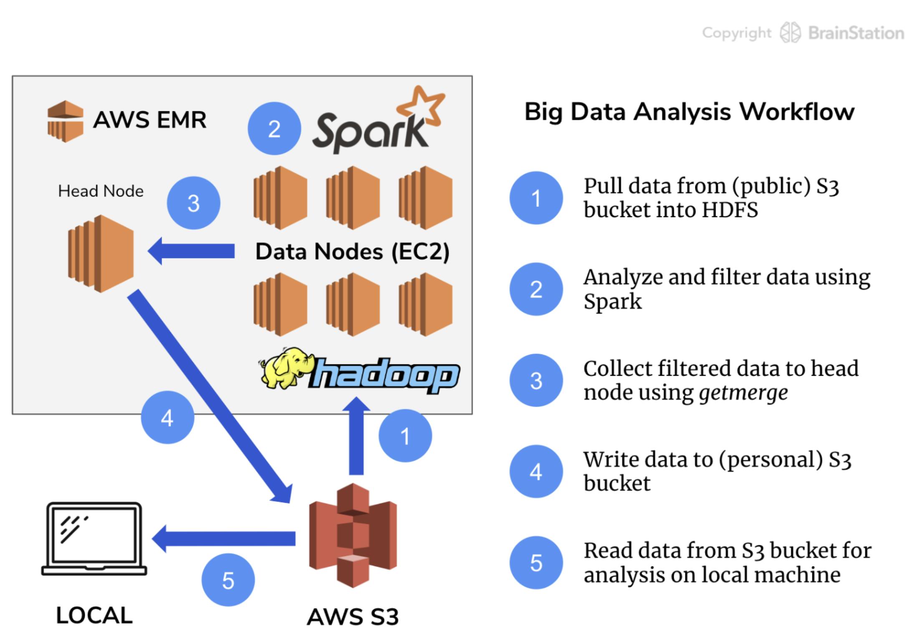

# Big Data Analysis Workflow Using Google Books Ngrams Dataset
In this document, the fundamental skills for working with Big Data such as loading, filtering, and visualizing a large real-world dataset in a cloud-based distributed computing environment using Hadoop, Spark, Hive, and the S3 file system are documented.   

The [Google Ngrams](https://books.google.com/ngrams/) dataset used throughout this document was created by Google's research team by analyzing all of the content in Google Books - these digitized texts represent approximately 4% of all books ever printed, and span a period from the 1800s into the 2000s.    

The dataset is hosted in a public S3 bucket as part of the [Amazon S3 Open Data Registry](https://registry.opendata.aws/google-ngrams/). For this document, the data is converted to CSV and hosted on a public S3 bucket which may be accessed here: [s3://brainstation-dsft/eng_1M_1gram.csv](http://brainstation-dsft.s3.ca-central-1.amazonaws.com/eng_1M_1gram.csv)     

Along with this document, two Jupyter Notebook files will be produced, which will follow a Big Data analysis workflow. As part of this workflow, you will filter and reduce data down to a manageable size and then do some analysis locally on our machine after extracting data from the Cloud and processing it using Big Data tools. The workflow and steps in the process are illustrated below:

